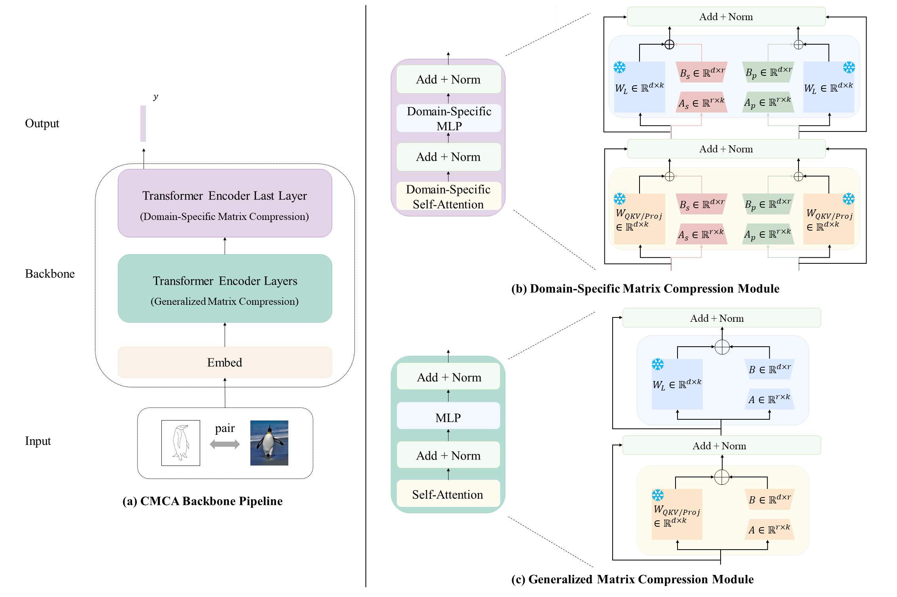

# Cross-Domain Matrix Compression Adaptation for Zero-Shot Sketch-Based Image Retrieval

This repository is our implementation of Cross-Domain Matrix Compression Adaptation for Zero-Shot Sketch-Based Image Retrieval, IJCNN2025.



> Abstract: This paper explores an efficient parameter fine-tuning strategy for zero-shot sketch-based image retrieval (ZS-SBIR). We highlight a key finding: through efficient parameter fine-tuning, excellent retrieval accuracy can be achieved using only 12% of the full parameters. This superior performance is attributed to low-rank matrix compression in the redundant parameter space, which extracts more discriminative effective feature dimensions. Specifically, to fully leverage the potential of pretrained models, we propose a cross-domain matrix compression adaptation method. For lower-level features, we apply a general low-rank decomposition to extract shared basic shapes or contours information across modalities. To mitigate overfitting to local similarities, we propose a domain-specific matrix compression module that guides the model in learning high-level abstractions essential for sketch retrieval. Our method is simple and effective, balancing both general semantic information and feature variations across domains within the same category. Experimental results on the ZS-SBIR benchmark dataset show that our method not only outperforms existing state-of-the-art methods, but also requires significantly fewer training parameters.

## Datasets

- For Sketchy, you can go to the [Sketchy official website](https://sketchy.eye.gatech.edu/)  to download the dataset.

- For TU-Berlin, you can go to the [TU-Berlin official website](https://cybertron.cg.tu-berlin.de/eitz/projects/classifysketch/) to download the dataset.

- For Quick, Draw!, you can go to the [Quick, Draw! official website](https://github.com/googlecreativelab/quickdraw-dataset)  to download the dataset.

  ```
  datasets
  ├── Sketchy
  │   └── photo ..
  │   └── sketch ..
  │   └── zeroshot2 ..
  ├── TUBerlin
  │   └── ImageResized_ready ..
  │   └── png_ready ..
  │   └── zeroshot ..
  ├── QuickDraw
  │   └── images ..
  │   └── sketches ..
  │   └── zeroshot ..
  ```

## Environment

The requirements of this repository are listed in the `environment.yml`.

```bash
conda env create -f environment.yml
# activate the environment
conda activate CMCA
```

## Train

### Pretrained DINOV2 backbone

We use ViT-B/14 from DINOv2 as the backbone. Please download the pretrained model from the [official DINOv2 GitHub repository](https://github.com/facebookresearch/dinov2). Then, place the file `dinov2_vitb14_pretrain.pth` into the `./utils` folder and modify line 22 in `./utils/model_dinov2.py` to absolute path if necessary.

### Train CMCA

Train model on Sketchy dataset:

```
python -m src.train_sketchy
```

Train model on TU-Berlin dataset:

```
python -m src.train_tuberlin
```

Train model on Quick, Draw! dataset:

```
python -m src.train_quickdraw
```

## Evaluation

### Our Trained Model

The trained model on Sketchy , TU-Berlin and Quick, Draw! is provided on [Google Drive](https://drive.google.com/drive/folders/1hH7rx8NnB8Jm-NIcHZgeyelaZFK1UWoe?usp=sharing). You should put these three folders in `./checkpoints/saved_models`.

### Evaluate CMCA 

Evaluate model on Sketchy dataset:

```python
python -m src.test_sketchy
```

Evaluate model on TU-Berlin dataset:

```python
python -m src.test_tuberlin
```

Evaluate model on Quick, Draw! dataset:

```python
python -m src.test_quickdraw
```

## Acknowledgments

Our code is partially adapted from the following repositories:
- [ZSE-SBIR](https://github.com/buptLinfy/ZSE-SBIR)
- [Sketch_LVM](https://github.com/aneeshan95/Sketch_LVM)

We sincerely thank the original authors for their excellent contributions.

## Citation

If you find this repository useful, please cite our paper:

```
@inproceedings{liu2025cmca,
    title={Cross-Domain Matrix Compression Adaptation for Zero-Shot Sketch-Based Image Retrieval},
    author={Decheng Liu, Xu Luo, Yu Zheng, Chunlei Peng},
    booktitle={Proceedings of the International Joint Conference on Neural Networks (IJCNN)},
    year={2025}，
    organization={IEEE}
}
```
